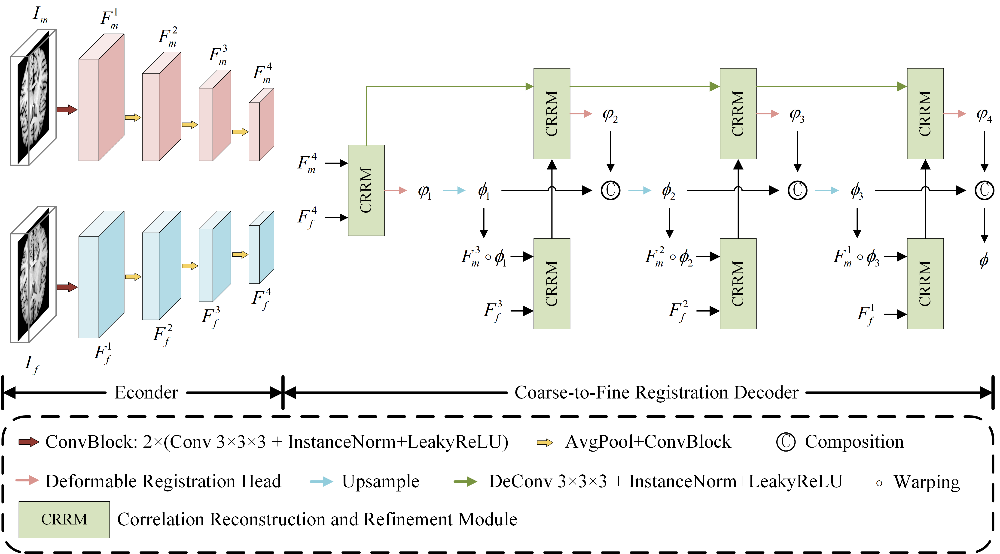

## CRR-Net: a correlation reconstruction and refinement network for deformable medical image registration
[](https://link.springer.com/article/10.1186/s42492-026-00222-4)
Official Pytorch implementation of *[CRR-Net: a correlation reconstruction and refinement network for deformable medical image registration](https://link.springer.com/article/10.1186/s42492-026-00222-4)*.

<p align="center">
  
</p>


### Requirements
The code has been tested on python 3.8 and pytorch 1.12.1.

### Datasets
- LPBA40 [[link](https://resource.loni.usc.edu/resources/atlases-downloads/)]
- Mindboggle [[link](https://osf.io/yhkde/)]
- ACDC [[link](https://www.creatis.insa-lyon.fr/Challenge/acdc/databases.html)]

### Usage
- Train CRR-Net
    ```shell
    sbatch train.sh
    ```

- Test CRR-Net

    ```shell
    sbatch infer.sh
    ```

### Citation
If you find this code or our paper useful for your research, please consider citing:
```
Xie, B., Zhang, G. & Xu, K. CRR-Net: a correlation reconstruction and refinement network for deformable medical image registration. Vis. Comput. Ind. Biomed. Art 9, 11 (2026). https://doi.org/10.1186/s42492-026-00222-4
```

### Related Work
For our ongoing work on 3D multimodal medical image registration, please follow the dedicated repository: [**DNAMorph**](https://github.com/miracledrumstick/DNAMorph).
